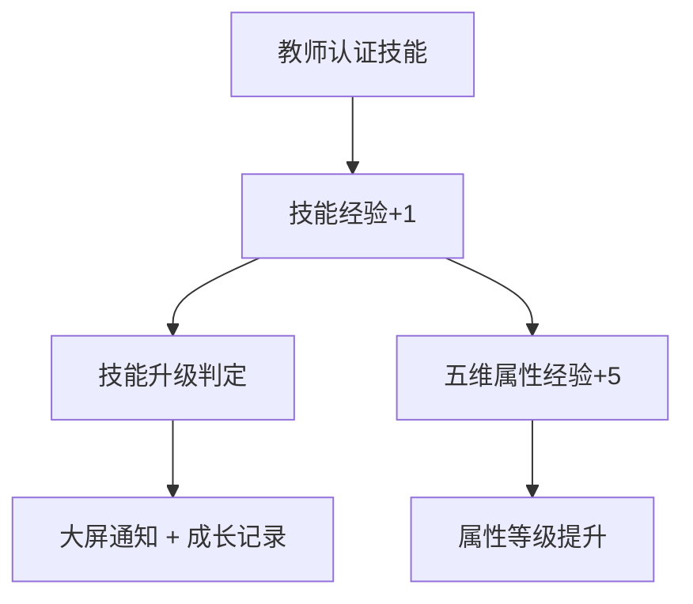
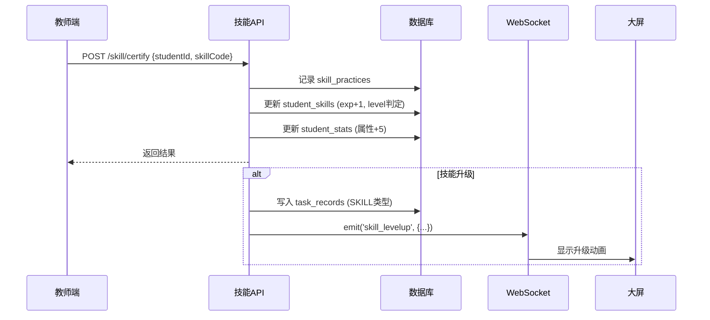

# 五维内功修炼系统完整说明

## 一、系统概述

五维内功系统是 ArkOK 的核心能力评估框架，通过 **技能修炼** → **属性积累** → **等级提升** 的机制，全面衡量学生的自主学习力。



---

## 二、五维内功维度定义

| 维度 | 英文KEY | 图标 | 颜色 | 核心含义 |
|------|---------|------|------|----------|
| **内省力** | `reflection` | 🟥 内 | 红色 | 自我检查、错误纠正、复盘能力 |
| **逻辑力** | `logic` | 🟦 逻 | 蓝色 | 推理分析、结构化思维、知识串联 |
| **自主力** | `autonomy` | 🟨 自 | 黄色 | 主动学习、自发探索、费曼传道 |
| **规划力** | `planning` | 🟩 规 | 绿色 | 时间管理、计划制定、优先级排序 |
| **毅力值** | `grit` | 🟧 毅 | 橙色 | 坚持不懈、百折不挠、持续积累 |

---

## 三、技能库与维度归属

### 🟥 内省力 (Reflection) - 6个技能

| 技能代码 | 技能名称 | Lv.1 (解锁) | Lv.2 | Lv.3 (大师) |
|----------|----------|-------------|------|-------------|
| `r_color` | 三色修补术 | 5exp 纠错学徒 | 20exp 订正能手 | 50exp 治愈大师 |
| `r_scan` | 雷达自检眼 | 3exp 扫雷兵 | 15exp 质检员 | 40exp 免检金牌 |
| `r_diagnosis` | 试卷体检法 | 2exp 查病单 | 8exp 诊疗师 | 20exp 神医圣手 |
| `r_diary` | 日悟心法 | 7exp 记录者 | 21exp 内省者 | 60exp 觉悟者 |
| `r_gap` | 盲区探照灯 | 5exp 提问生 | 20exp 补漏匠 | 50exp 无缺公子 |
| `r_detail` | 细读定身咒 | 10exp 圈词人 | 30exp 审题王 | 80exp 火眼金睛 |

### 🟦 逻辑力 (Logic) - 6个技能

| 技能代码 | 技能名称 | Lv.1 (解锁) | Lv.2 | Lv.3 (大师) |
|----------|----------|-------------|------|-------------|
| `l_source` | 母题溯源眼 | 3exp 寻源者 | 10exp 破题手 | 30exp 通透宗师 |
| `l_draft` | 思维草图术 | 5exp 草稿新手 | 20exp 绘图师 | 50exp 推演专家 |
| `l_struct` | 结构解牛刀 | 3exp 拆书匠 | 10exp 架构师 | 30exp 全知视界 |
| `l_compare` | 异同辨析手 | 3exp 辨字员 | 10exp 明眼人 | 30exp 鉴别大师 |
| `l_model` | 万能模型卡 | 2exp 模具工 | 8exp 建模师 | 20exp 举一反三 |
| `l_connect` | 知识串联桥 | 2exp 织网蛛 | 5exp 筑桥师 | 15exp 体系构建者 |

### 🟨 自主力 (Autonomy) - 6个技能

| 技能代码 | 技能名称 | Lv.1 (解锁) | Lv.2 | Lv.3 (大师) |
|----------|----------|-------------|------|-------------|
| `a_feynman` | 费曼传道 | 3exp 小助教 | 15exp 讲坛新秀 | 40exp 传道教授 |
| `a_bloom` | 语感爆棚手 | 10exp 采花童 | 50exp 词汇库 | 200exp 博学文曲 |
| `a_hunt` | 素材捕捉手 | 5exp 拾贝者 | 20exp 收藏家 | 60exp 生活智者 |
| `a_ask` | 追问求索心 | 5exp 好奇宝宝 | 15exp 探究员 | 40exp 真理追求者 |
| `a_help` | 侠义助人 | 5exp 热心肠 | 20exp 及时雨 | 50exp 侠之大者 |
| `a_life` | 生活算术师 | 2exp 应用生 | 8exp 精算师 | 20exp 实干家 |

### 🟩 规划力 (Planning) - 5个技能

| 技能代码 | 技能名称 | Lv.1 (解锁) | Lv.2 | Lv.3 (大师) |
|----------|----------|-------------|------|-------------|
| `p_helm` | 掌舵规划术 | 2exp 水手 | 8exp 大副 | 20exp 传奇船长 |
| `p_scout` | 前哨侦查兵 | 5exp 探路者 | 20exp 先锋官 | 50exp 预知未来 |
| `p_bag` | 收纳卫士 | 7exp 整理员 | 30exp 管家 | 90exp 井井有条 |
| `p_tomato` | 番茄时钟法 | 10exp 守时者 | 40exp 效率达人 | 100exp 时间领主 |
| `p_priority` | 要事第一策 | 5exp 排序员 | 20exp 执行官 | 60exp 运筹帷幄 |

### 🟧 毅力值 (Grit) - 5个技能

| 技能代码 | 技能名称 | Lv.1 (解锁) | Lv.2 | Lv.3 (大师) |
|----------|----------|-------------|------|-------------|
| `g_zen` | 定力禅修 | 5exp 静心 | 20exp 入定 | 60exp 金刚不坏 |
| `g_streak` | 薪火相传 | 7exp 点火者 | 21exp 持炬人 | 100exp 永恒之火 |
| `g_retry` | 百折不挠 | 3exp 挑战者 | 10exp 破壁人 | 30exp 逆境战神 |
| `g_drill` | 千锤百炼 | 20exp 苦修僧 | 80exp 基本功王 | 200exp 肌肉记忆 |
| `g_accum` | 滴水穿石 | 10exp 积水潭 | 50exp 汇川河 | 200exp 汪洋海 |

---

## 四、三层等级系统 (2026-01-08 更新)

### 4.1 系统架构概览

```
┌─────────────────────────────────────────────────────────────────┐
│                    总等级 (Character Level)                     │
│     TotalExp = 内省力经验 + 逻辑力经验 + 自主力经验 + ...        │
│              + PK奖励 + 挑战奖励 + 习惯打卡 + ...                │
│     Lv.1-10: 初窥门径 → 一代宗师 (0-23000 exp)                  │
└─────────────────────────────────────────────────────────────────┘
                              ▲
       ┌──────────────────────┼──────────────────────┐
       ▼                      ▼                      ▼
┌──────────────────┐   ┌──────────────────┐   ┌──────────────────┐
│ 内省力 Lv.1-5    │   │ 逻辑力 Lv.1-5    │   │ ...              │
│ = Σ 该维度下     │   │ = Σ 该维度下     │   │                  │
│   所有技能经验    │   │   所有技能经验    │   │                  │
│ 学徒→首席(0-150) │   │ 学徒→首席(0-150) │   │                  │
└────────┬─────────┘   └────────┬─────────┘   └──────────────────┘
         │                      │
         ▼                      ▼
    三色修补术 Lv.1-3      母题溯源眼 Lv.1-3
    雷达自检眼 Lv.1-3      思维草图术 Lv.1-3
       ...                    ...
```

### 4.2 总等级 (Character Level)

**配置文件**: `server/src/config/levelConfig.ts`

| 等级 | 称号 | 累计经验 | 预计耗时 |
|:---:|------|:-------:|:-------:|
| Lv.1 | 初窥门径 | 0 | 初始 |
| Lv.2 | 略有小成 | 500 | ~1周 |
| Lv.3 | 驾轻就熟 | 1500 | ~2周 |
| Lv.4 | 融会贯通 | 3000 | ~1个月 |
| Lv.5 | 炉火纯青 | 5000 | ~1.5个月 |
| Lv.6 | 出类拔萃 | 7500 | ~2个月 |
| Lv.7 | 神乎其技 | 10500 | ~3个月 |
| Lv.8 | 登峰造极 | 14000 | ~4个月 |
| Lv.9 | 返璞归真 | 18000 | ~5个月 |
| Lv.10 | 一代宗师 | 23000 | 学年末 |

> **全局倍率调整**: 修改 `EXP_MULTIPLIER` (1.0=正常, 0.8=升级快20%, 1.2=升级慢20%)

### 4.3 维度等级 (Dimension Level)

每个维度经验 = 该维度下所有技能经验的总和

| 维度等级 | 称号 | 所需经验 |
|:--------:|------|:--------:|
| Lv.1 | 学徒 | 0 |
| Lv.2 | 能手 | 10 |
| Lv.3 | 专家 | 40 |
| Lv.4 | 大师 | 80 |
| Lv.5 | 首席 | 150 |

**显示格式**: `内省力 Lv.3: 专家`

### 4.4 技能等级 (Skill Level)

每个技能有独立的 3 级阈值（见第三节技能库表格）

**显示格式**: `三色修补术 - 订正能手 (Lv.2)`

### 4.5 经验来源汇总

| 经验来源 | 影响总等级 | 影响维度等级 | 影响技能等级 | 单次经验 |
|----------|:----------:|:------------:|:------------:|:--------:|
| **QC过关** (映射技能) | ✅ | ✅ | ✅ | 1 exp/技能 |
| **教师手动认证** | ✅ | ✅ | ✅ | 1 exp/技能 |
| **连胜里程碑** (g_streak) | ✅ | ✅ 毅力值 | ✅ g_streak | 10-500 exp |
| **重新过关** (g_retry) | ✅ | ✅ 毅力值 | ✅ g_retry | 1 exp |
| **PK获胜** | ✅ | ❌ | ❌ | 10-50 exp |
| **挑战完成** | ✅ | ❌ | ❌ | 20-100 exp |
| **习惯打卡** | ✅ | ❌ | ❌ | 自定义 (5-15 exp) |

### 4.6 连胜里程碑奖励 (g_streak)

| 连胜次数 | 奖励经验 |
|:--------:|:--------:|
| 3 | +10 exp |
| 7 | +30 exp |
| 14 | +60 exp |
| 21 | +100 exp |
| 30 | +150 exp |
| 50 | +250 exp |
| 100 | +500 exp |

---

## 五、两套评分系统对比

| 特性 | 个人详情页 (StudentDetail) | 大屏详情页 (StudentDetailOverlay) |
|------|---------------------------|----------------------------------|
| **数据源** | `student_stats` 表 | `calculateRadarStats` 函数 |
| **评分类型** | 累积计数 | 动态百分制 |
| **更新触发** | 技能认证时 | 每次加载实时计算 |
| **适用场景** | 展示历史成就积累 | 展示当前能力状态 |

---

## 六、数据流向图



---

## 七、相关数据表

| 表名 | 用途 |
|------|------|
| `skills` | 技能定义（28个预置技能） |
| `student_skills` | 学生技能进度（每个学生×每个技能） |
| `skill_practices` | 技能修炼记录（认证历史） |
| `student_stats` | 学生五维属性累积值 |
| `task_records` | 成长记录（技能升级会写入 type=SKILL） |

---

## 八、前端展示位置

| 位置 | 组件 | 展示内容 |
|------|------|----------|
| 个人详情页 - 成长激励 | `StudentDetail.tsx` | 五维紧凑卡片 + Lv.X |
| 大屏学生详情 | `StudentDetailOverlay.tsx` | 五边形雷达图 + 维度名Lv.X |
| 家长端成长档案 | `GrowthProfile.tsx` | 雷达图 + 已解锁技能列表 |

---

## 九、任务库分类体系 (educationalDomain)

| 领域 | 英文代码 | 用途 | 对应技能维度 |
|------|----------|------|--------------|
| **学业过关** | `PROGRESS` | 语数英每日过关项 (QC类型) | - |
| **核心教学法** | `METHODOLOGY` | 学习方法论训练 | 内省力、逻辑力、自主力、规划力 |
| **综合成长** | `GROWTH` | 阅读、整理、互助、家庭联结 | 自主力、毅力值 |
| **习惯养成** | `HABIT` | 每日习惯打卡 | 毅力值 |
| **个性加餐** | `PERSONALIZED` | 定制化辅导任务 | 视内容而定 |

---

## 十、核心教学法任务库 (METHODOLOGY)

### 10.1 基础学习方法论 → 关联技能：三色修补术、雷达自检眼
| 学习动作 | 能力培养 |
|----------|----------|
| 用"三色笔法"整理作业 | 纠错能力、复盘意识 |
| 错题的红笔订正 | 错误改正、自我检查 |
| 作业的自主检查 | 审题能力、细节关注 |
| 试卷体检法 | 问题诊断、盲区发现 |
| 自评当日作业质量 | 元认知、反思能力 |
| 错题的摘抄与归因 | 规律发现、归纳能力 |
| 记录并解决盲区问题 | 主动求索、查漏补缺 |
| 书写工整 | 习惯养成、专注力 |

### 10.2 数学思维与解题策略 → 关联技能：母题溯源眼、思维草图术、万能模型卡
| 学习动作 | 能力培养 |
|----------|----------|
| 错题归类与规律发现 | 归纳总结、模式识别 |
| 用"画图法"理解应用题 | 可视化思维、建模能力 |
| 用"分步法"讲解数学题 | 费曼传道、逻辑表达 |
| 草稿纸规范使用 | 思维有序、过程可追溯 |
| 一题多解练习 | 发散思维、创造力 |
| 整理易混淆点对比表 | 辨析能力、精准理解 |
| 总结解题模型与套路 | 举一反三、知识迁移 |
| 圈画审题关键词 | 细读能力、审题精准 |
| 口算限时挑战 | 速度与准确性、抗压 |

### 10.3 语文学科能力深化 → 关联技能：语感爆棚手、细读定身咒
| 学习动作 | 能力培养 |
|----------|----------|
| 课文朗读与背诵 | 语感、记忆力 |
| 生字词听写 | 词汇积累、书写规范 |
| 阅读理解策略练习 | 信息提取、推理能力 |
| 作文提纲与修改 | 规划表达、迭代优化 |

### 10.4 英语应用与输出
| 学习动作 | 能力培养 |
|----------|----------|
| 单词听写与默写 | 词汇记忆、拼写能力 |
| 课文朗读与背诵 | 语音语调、语感培养 |
| 口语对话练习 | 应用输出、交际能力 |
| 听力理解训练 | 听觉专注、信息捕捉 |

### 10.5 阅读深度与分享 → 关联技能：素材捕捉手
| 学习动作 | 能力培养 |
|----------|----------|
| 阅读记录卡填写 | 阅读习惯、记录意识 |
| 好词好句摘抄 | 素材积累、语言感知 |
| 读后感分享 | 表达输出、深度思考 |
| 阅读推荐 | 分享能力、同伴影响 |
| 课外阅读30分钟 | 持续阅读、专注力 |

### 10.6 自主学习与规划 → 关联技能：掌舵规划术、前哨侦查兵、要事第一策
| 学习动作 | 能力培养 |
|----------|----------|
| 制定学习计划 | 规划意识、目标管理 |
| 时间管理练习 | 效率意识、优先级 |
| 目标设定与回顾 | PDCA循环、复盘能力 |
| 自主预习 | 主动学习、超前意识 |
| 有效预习并打卡 | 习惯固化、自律 |
| 任务优先级排序 | 决策能力、要事第一 |
| 离校前的书包整理 | 条理性、收纳习惯 |

### 10.7 课堂互动与深度参与 → 关联技能：费曼传道、追问求索心
| 学习动作 | 能力培养 |
|----------|----------|
| 主动举手发言 | 自信表达、参与意识 |
| 小组讨论参与 | 协作能力、倾听能力 |
| 提出有价值的问题 | 批判性思维、好奇心 |
| 帮助同学讲解 | 教学相长、巩固理解 |

### 10.8 家庭联结与知识迁移 → 关联技能：生活算术师、侠义助人
| 学习动作 | 能力培养 |
|----------|----------|
| 与家长分享学习内容 | 表达能力、家校联动 |
| 生活中的知识应用 | 知识迁移、实践能力 |
| 家校沟通反馈 | 沟通能力、责任感 |
| 家庭作业展示 | 成就感、自信心 |

### 10.9 高阶输出与创新 → 关联技能：知识串联桥
| 学习动作 | 能力培养 |
|----------|----------|
| 创意写作 | 创造力、表达力 |
| 项目展示 | 综合能力、演示技巧 |
| 知识总结思维导图 | 结构化思维、体系构建 |
| 跨学科应用 | 融会贯通、创新思维 |

---

## 十一、综合成长任务库 (GROWTH)

### 11.1 阅读广度类 → 关联维度：毅力值
- 年级同步阅读
- 课外阅读30分钟
- 填写阅读记录单
- 阅读一个成语故事，并积累掌握3个成语

### 11.2 整理与贡献类 → 关联维度：规划力、自主力
- 离校前的个人卫生清理（桌面/抽屉/地面）
- 离校前的书包整理
- 一项集体贡献任务（浇花/整理书架/打扫等）
- 吃饭时帮助维护秩序，确认光盘
- 为班级图书角推荐一本书，并写一句推荐语

### 11.3 互助与创新类 → 关联维度：自主力
- 帮助同学（讲解/拍视频/打印等）
- 一项创意表达任务（画画/写日记/做手工等）
- 一项健康活力任务（眼保健操/拉伸/深呼吸/跳绳等）
- 完成一次专注力训练

### 11.4 家庭联结类 → 关联维度：毅力值、自主力
- 与家人共读30分钟（可亲子读、兄弟姐妹读、给长辈读）
- 帮家里完成一项力所及的家务（摆碗筷、倒垃圾/整理鞋柜等）

---

## 十二、学业过关任务 (PROGRESS - QC类型)

### 12.1 语文过关
| 任务名称 | 默认经验 | 描述 |
|----------|----------|------|
| 生字听写 | 8 exp | 本课生字听写训练 |
| 课文背诵 | 10 exp | 流利背诵课文段落 |
| 古诗默写 | 12 exp | 古诗默写与理解 |
| 生字组词 | 8 exp | 生字扩展词汇 |
| 朗读课文 | 8 exp | 流利朗读课文 |

### 12.2 数学过关
| 任务名称 | 默认经验 | 描述 |
|----------|----------|------|
| 口算达标 | 8 exp | 10分钟口算练习 |
| 竖式计算 | 12 exp | 多位数竖式计算 |
| 计算练习 | 10 exp | 综合计算能力 |
| 应用题 | 12 exp | 数学应用题解答 |
| 错题订正 | 8 exp | 改正错误题目 |

### 12.3 英语过关
| 任务名称 | 默认经验 | 描述 |
|----------|----------|------|
| 单词默写 | 8 exp | 本单元单词默写 |
| 听力理解 | 8 exp | 英语听力理解训练 |
| 中英互译 | 10 exp | 中英文互译练习 |
| 句型背诵 | 10 exp | 常用句型背诵 |
| 课文背诵 | 10 exp | 英语课文背诵 |

---

## 十三、连胜分类配置 (STREAK_CATEGORIES_CONFIG)

连胜记录按学科分类，用于追踪学生在特定任务类型上的连续全对表现：

| 学科 | 连胜项目 | 代码 |
|------|----------|------|
| **语文** | 校内作业 | `cn_homework` |
| | 课文背诵 | `cn_recitation` |
| | 生字组词 | `cn_vocabulary` |
| | 默写课文 | `cn_dictation_writing` |
| | 听写词语 | `cn_dictation` |
| | 朗读课文 | `cn_reading` |
| **数学** | 校内作业 | `math_homework` |
| | 口算练习 | `math_calculation` |
| | 计算练习 | `math_calculation_2` |
| | 应用题 | `math_word_problem` |
| | 错题订正 | `math_mistakes` |
| **英语** | 校内作业 | `en_homework` |
| | 单词默写 | `en_dictation` |
| | 中英互译 | `en_translation` |
| | 句型背诵 | `en_sentences` |
| | 课文背诵 | `en_recitation` |

---

## 十四、任务与技能完整映射表 (平衡修订版)

> **核心调整策略**：
> 1. **削减费曼（De-Feynman）**：将"讲解数学题"归还给**逻辑力**，让费曼专指"教学相长"
> 2. **规划力前置（Planning First）**：将"提纲"、"预习"、"目标设定"等涉及*事前准备*的动作，强制划归**规划力**
> 3. **细化毅力（Refining Grit）**：将单纯的"刷题（Drill）"与需要静心的"书写/专注（Zen）"和"积累（Accumulate）"区分开

### 14.1 基础学习方法论 (8个任务)
> **调整重点**：将"书写工整"从毅力值移至**内省力**（关注细节），提升内省力比重。

| 任务名称 | 技能代码 | 技能名称 | 维度 | 调整说明 |
| :--- | :--- | :--- | :--- | :--- |
| 用"三色笔法"整理作业 | `r_color` | 三色修补术 | 🟥内省力 | - |
| 错题的红笔订正 | `r_color` | 三色修补术 | 🟥内省力 | - |
| 作业的自主检查 | `r_scan` | 雷达自检眼 | 🟥内省力 | - |
| 试卷体检法 | `r_diagnosis`| 试卷体检法 | 🟥内省力 | - |
| 自评当日作业质量 | `r_diary` | 日悟心法 | 🟥内省力 | - |
| 错题的摘抄与归因 | `r_gap` | 盲区探照灯 | 🟥内省力 | - |
| 记录并解决盲区问题 | `r_gap` | 盲区探照灯 | 🟥内省力 | - |
| 书写工整 | `r_detail` | **细读定身咒** | �内省力 | **调整**：从毅力改为内省。书写不仅是坚持，更是对细节的自我要求。 |

### 14.2 数学思维与解题策略 (9个任务)
> **调整重点**：大幅增加**逻辑力**。将"讲解数学题"改为逻辑结构训练；"规律发现"改为母题溯源。

| 任务名称 | 技能代码 | 技能名称 | 维度 | 调整说明 |
| :--- | :--- | :--- | :--- | :--- |
| 错题归类与规律发现 | `l_source` | 母题溯源眼 | 🟦逻辑力 | - |
| 用"画图法"理解应用题 | `l_draft` | 思维草图术 | 🟦逻辑力 | - |
| 用"分步法"讲解数学题 | `l_struct` | **结构解牛刀** | �逻辑力 | **调整**：从费曼改为逻辑。讲数学题重点在于思维的结构化（第一步、第二步）。 |
| 草稿纸规范使用 | `l_draft` | 思维草图术 | 🟦逻辑力 | - |
| 一题多解练习 | `l_model` | 万能模型卡 | 🟦逻辑力 | - |
| 整理易混淆点对比表 | `l_compare` | 异同辨析手 | 🟦逻辑力 | - |
| 总结解题模型与套路 | `l_model` | 万能模型卡 | 🟦逻辑力 | - |
| 圈画审题关键词 | `r_detail` | 细读定身咒 | 🟥内省力 | - |
| 口算限时挑战 | `g_drill` | 千锤百炼 | 🟧毅力值 | - |

### 14.3 语文学科能力深化 (4个任务)
> **调整重点**：将"作文提纲"划归**规划力**，这是极其重要的规划训练。

| 任务名称 | 技能代码 | 技能名称 | 维度 | 调整说明 |
| :--- | :--- | :--- | :--- | :--- |
| 课文朗读与背诵 | `g_accum` | **滴水穿石** | 🟧毅力值 | **调整**：改为积累。语感是靠日积月累，而非单纯机械训练。 |
| 生字词听写 | `a_bloom` | 语感爆棚手 | 🟨自主力 | - |
| 阅读理解策略练习 | `l_compare` | **异同辨析手** | �逻辑力 | **调整**：阅读理解核心是文中信息的提取与辨析。 |
| 作文提纲与修改 | `p_helm` | **掌舵规划术** | �规划力 | **调整**：写提纲就是"做计划"，强补规划力短板。 |

### 14.4 英语应用与输出 (4个任务)

| 任务名称 | 技能代码 | 技能名称 | 维度 | 调整说明 |
| :--- | :--- | :--- | :--- | :--- |
| 单词听写与默写 | `g_drill` | 千锤百炼 | �毅力值 | - |
| 课文朗读与背诵 | `a_bloom` | **语感爆棚手** | �自主力 | **调整**：强调语言的丰富度积累。 |
| 口语对话练习 | `a_feynman` | 费曼传道 | 🟨自主力 | - |
| 听力理解训练 | `g_zen` | 定力禅修 | 🟧毅力值 | - |

### 14.5 阅读深度与分享 (5个任务)

| 任务名称 | 技能代码 | 技能名称 | 维度 | 调整说明 |
| :--- | :--- | :--- | :--- | :--- |
| 阅读记录卡填写 | `r_diary` | 日悟心法 | 🟥内省力 | - |
| 好词好句摘抄 | `a_hunt` | 素材捕捉手 | 🟨自主力 | - |
| 读后感分享 | `l_connect` | **知识串联桥** | �逻辑力 | **调整**：读后感通常涉及将书本内容与生活/其他知识串联。 |
| 阅读推荐 | `a_feynman` | 费曼传道 | 🟨自主力 | - |
| 课外阅读30分钟 | `g_accum` | 滴水穿石 | 🟧毅力值 | - |

### 14.6 自主学习与规划 (7个任务)
> **调整重点**：通过调整，确保**规划力**是本板块的绝对核心。

| 任务名称 | 技能代码 | 技能名称 | 维度 | 调整说明 |
| :--- | :--- | :--- | :--- | :--- |
| 制定学习计划 | `p_helm` | 掌舵规划术 | 🟩规划力 | - |
| 时间管理练习 | `p_tomato` | 番茄时钟法 | 🟩规划力 | - |
| 目标设定与回顾 | `p_helm` | **掌舵规划术** | �规划力 | **调整**：目标设定属于宏观规划。 |
| 自主预习 | `p_scout` | 前哨侦查兵 | 🟩规划力 | - |
| 有效预习并打卡 | `p_scout` | 前哨侦查兵 | 🟩规划力 | - |
| 任务优先级排序 | `p_priority` | 要事第一策 | 🟩规划力 | - |
| 离校前的书包整理 | `p_bag` | 收纳卫士 | 🟩规划力 | - |

### 14.7 课堂互动与深度参与 (4个任务)

| 任务名称 | 技能代码 | 技能名称 | 维度 | 调整说明 |
| :--- | :--- | :--- | :--- | :--- |
| 主动举手发言 | `g_retry` | **百折不挠** | �毅力值 | **调整**：举手需要勇气（特别是答错也不怕），补充稀缺的 Retry。 |
| 小组讨论参与 | `l_connect` | **知识串联桥** | �逻辑力 | **调整**：讨论是观点碰撞和连接的过程。 |
| 提出有价值的问题 | `a_ask` | 追问求索心 | 🟨自主力 | - |
| 帮助同学讲解 | `a_feynman` | 费曼传道 | 🟨自主力 | - |

### 14.8 家庭联结与知识迁移 (4个任务)

| 任务名称 | 技能代码 | 技能名称 | 维度 | 调整说明 |
| :--- | :--- | :--- | :--- | :--- |
| 与家长分享学习内容 | `a_feynman` | 费曼传道 | 🟨自主力 | - |
| 生活中的知识应用 | `a_life` | 生活算术师 | 🟨自主力 | - |
| 家校沟通反馈 | `r_diary` | **日悟心法** | �内省力 | **调整**：反馈通常包含对近期表现的反思。 |
| 家庭作业展示 | `g_accum` | **滴水穿石** | �毅力值 | **调整**：展示的是长期努力的成果。 |

### 14.9 高阶输出与创新 (4个任务)

| 任务名称 | 技能代码 | 技能名称 | 维度 | 调整说明 |
| :--- | :--- | :--- | :--- | :--- |
| 创意写作 | `l_struct` | 结构解牛刀 | 🟦逻辑力 | - |
| 项目展示 | `p_scout` | **前哨侦查兵** | �规划力 | **调整**：好的项目展示需要大量的预先准备（侦查/调研）。 |
| 知识总结思维导图 | `l_connect` | 知识串联桥 | 🟦逻辑力 | - |
| 跨学科应用 | `l_model` | **万能模型卡** | 🟦逻辑力 | **调整**：模型迁移能力。 |

---

## 十五、综合成长任务映射 (GROWTH)

### 15.1 阅读广度类
| 任务名称 | 技能代码 | 技能名称 | 维度 |
| :--- | :--- | :--- | :--- |
| 年级同步阅读 | `g_accum` | 滴水穿石 | 🟧毅力值 |
| 课外阅读30分钟 | `g_accum` | 滴水穿石 | 🟧毅力值 |
| 填写阅读记录单 | `r_diary` | 日悟心法 | 🟥内省力 |
| 阅读成语故事 | `a_hunt` | 素材捕捉手 | 🟨自主力 |

### 15.2 整理与贡献类
| 任务名称 | 技能代码 | 技能名称 | 维度 |
| :--- | :--- | :--- | :--- |
| 离校前个人卫生清理 | `p_bag` | 收纳卫士 | 🟩规划力 |
| 离校前书包整理 | `p_bag` | 收纳卫士 | 🟩规划力 |
| 集体贡献任务 | `a_help` | 侠义助人 | 🟨自主力 |
| 帮助维护用餐秩序 | `a_help` | 侠义助人 | 🟨自主力 |
| 为图书角推荐书籍 | `a_hunt` | 素材捕捉手 | 🟨自主力 |

### 15.3 互助与创新类
| 任务名称 | 技能代码 | 技能名称 | 维度 |
| :--- | :--- | :--- | :--- |
| 帮助同学 | `a_help` | 侠义助人 | 🟨自主力 |
| 创意表达任务 | `a_life` | **生活算术师** | �自主力 |
| 健康活力任务 | `g_zen` | 定力禅修 | 🟧毅力值 |
| 完成专注力训练 | `g_zen` | 定力禅修 | 🟧毅力值 |

### 15.4 家庭联结类
| 任务名称 | 技能代码 | 技能名称 | 维度 |
| :--- | :--- | :--- | :--- |
| 与家人共读30分钟 | `a_help` | **侠义助人** | �自主力 |
| 帮家里完成家务 | `a_life` | 生活算术师 | 🟨自主力 |

---

## 十六、学业过关任务映射 (QC - 建议值)

> 此部分建议配合"连胜机制"或"每日上限"使用，避免刷分。

| 任务类型 | 任务名称 | 技能代码 | 技能名称 | 维度 |
| :--- | :--- | :--- | :--- | :--- |
| **语文** | 生字听写 | `g_drill` | 千锤百炼 | 🟧毅力值 |
| | 课文背诵 | `g_drill` | 千锤百炼 | 🟧毅力值 |
| | 古诗默写 | `g_drill` | 千锤百炼 | 🟧毅力值 |
| | 生字组词 | `a_bloom` | 语感爆棚手 | 🟨自主力 |
| | 朗读课文 | `g_accum` | 滴水穿石 | 🟧毅力值 |
| **数学** | 口算达标 | `g_drill` | 千锤百炼 | 🟧毅力值 |
| | 竖式计算 | `l_draft` | 思维草图术 | 🟦逻辑力 |
| | 计算练习 | `g_drill` | 千锤百炼 | 🟧毅力值 |
| | 应用题 | `l_source` | **母题溯源眼** | 🟦逻辑力 |
| | 错题订正 | `r_color` | 三色修补术 | 🟥内省力 |
| **英语** | 单词默写 | `g_drill` | 千锤百炼 | 🟧毅力值 |
| | 听力理解 | `g_zen` | 定力禅修 | 🟧毅力值 |
| | 中英互译 | `l_compare` | 异同辨析手 | 🟦逻辑力 |
| | 句型背诵 | `g_drill` | 千锤百炼 | 🟧毅力值 |
| | 课文背诵 | `g_drill` | 千锤百炼 | 🟧毅力值 |

---

## 十七、机制型技能映射 (系统自动触发)

这是之前缺失的重要一环，必须在文档中明确。

| 触发场景 | 技能代码 | 技能名称 | 维度 | 触发逻辑 (伪代码) |
| :--- | :--- | :--- | :--- | :--- |
| **连胜奖励** | `g_streak` | 薪火相传 | 🟧毅力值 | `if (streak_count % 3 == 0) award('g_streak')` |
| **补过/逆袭** | `g_retry` | 百折不挠 | �毅力值 | `if (task.status == 'PASSED' && task.history.has('FAILED')) award('g_retry')` |

---

## 十八、调整后的分布统计

对比上一版，现在分布更加健康，**逻辑力**和**规划力**得到了显著加强。

| 维度 | 英文KEY | 核心技能与频次 (Top Skills) | 评价 |
| :--- | :--- | :--- | :--- |
| 🟥 **内省力** | `reflection` | `r_color` (3), `r_diary` (4), `r_detail` (2) | 稳健，覆盖了订正、复盘、细节。 |
| 🟦 **逻辑力** | `logic` | `l_struct` (2), `l_compare` (3), `l_draft` (2) | **大幅提升**。现在覆盖了讲题、阅读、写作、应用题。 |
| 🟨 **自主力** | `autonomy` | `a_feynman` (**5**), `a_help` (5), `a_bloom` (3) | **已平衡**。费曼从10降到5，不再一家独大。 |
| 🟩 **规划力** | `planning` | `p_helm` (**3**), `p_bag` (4), `p_scout` (3) | **显著增强**。提纲、预习、目标设定都进来了。 |
| 🟧 **毅力值** | `grit` | `g_drill` (6), `g_accum` (4), `g_zen` (3) | **多元化**。不再只有死记硬背(Drill)，增加了静心(Zen)和积累(Accum)。 |

---

## 十九、版本变更记录

| 版本 | 日期 | 修订内容 |
|------|------|----------|
| v1.0 | 2026-01-08 | 初版创建，包含28技能和50+任务映射 |
| v1.1 | 2026-01-08 | **平衡修订版**：削减费曼(10→5)、规划力前置、细化毅力分类 |

